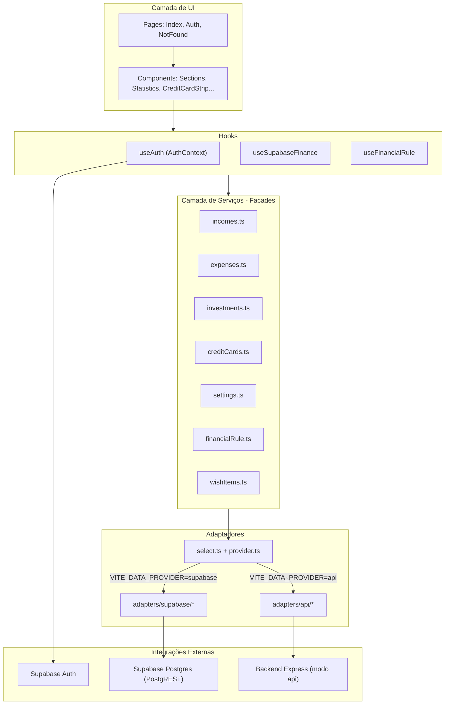

# Visão Geral do Sistema

**Tidy Month Tracker** é um aplicativo de controle financeiro pessoal focado no acompanhamento mensal de entradas, gastos, investimentos e lista de desejos, com suporte a cartões de crédito, regra financeira (50/30/20 ou personalizada) e visão anual estatística.

**Escopo desta documentação:** apenas o **frontend** (`frontend/`), conforme a fase atual descrita em [`PLANO_FRONTEND_DIRETO_SUPABASE.md`](./PLANO_FRONTEND_DIRETO_SUPABASE.md), em que o app em produção (Vercel) acessa o **Supabase** diretamente, sem backend Express.

| Aspecto | Evidência no código |
|---------|---------------------|
| Stack | React 18 + Vite + TypeScript + Tailwind + shadcn/ui |
| Roteamento | React Router — 3 rotas (`/`, `/auth`, `*`) em `src/App.tsx` |
| Autenticação | Supabase Auth via `src/contexts/AuthContext.tsx` |
| Persistência (fase atual) | Supabase Postgres via adaptadores em `src/services/adapters/supabase/` |
| Provedor de dados | `VITE_DATA_PROVIDER=supabase` (padrão em `.env.example`) |
| Usuários | 1 usuário autenticado por sessão; isolamento por RLS (`auth.uid() = user_id`) |

**O que o sistema NÃO possui no frontend (confirmado por ausência no código):**

- Módulo de administração de usuários
- Assinaturas / gateway de pagamento
- Open Finance / integração bancária
- Exportação / importação de dados
- Feature flags além da variável `VITE_DATA_PROVIDER`
- Analytics, e-mail transacional, WhatsApp ou push notifications (exceto e-mail de confirmação do Supabase Auth no cadastro)

---

# Arquitetura

## Diagrama de camadas



## Padrão adaptador de dados

Evidência: `src/services/adapters/provider.ts`, `src/services/adapters/select.ts`.

- `VITE_DATA_PROVIDER=supabase` → adaptadores Supabase (fase atual)
- Qualquer outro valor ou ausência → adaptadores API (`apiClient` → backend Express)

Os componentes **não** importam `supabase` nem `apiClient` diretamente; consomem apenas `src/services/*`.

## Estrutura de diretórios relevante

| Caminho | Papel |
|---------|-------|
| `src/pages/` | Páginas de rota |
| `src/components/` | UI de negócio e layout |
| `src/components/ui/` | Componentes base (shadcn) |
| `src/hooks/` | Estado e orquestração de dados |
| `src/contexts/` | Autenticação global |
| `src/services/` | Facades + adaptadores |
| `src/types/domain.ts` | Tipos de domínio |
| `src/types/finance.ts` | Aliases + defaults (tags, categorias, cores) |
| `src/utils/business/` | Lógica pura (parcelas, repetição mensal, desejos) |
| `src/utils/financialRuleCalculations.ts` | Cálculos da regra financeira |
| `src/integrations/supabase/` | Cliente e tipos gerados do banco |
| `src/api/client.ts` | Cliente HTTP (modo `api`) |

## Rotas

| Rota | Componente | Proteção | Descrição |
|------|-------------|----------|-----------|
| `/auth` | `Auth.tsx` | Pública | Login e cadastro |
| `/` | `Index.tsx` | `ProtectedRoute` | Dashboard principal |
| `*` | `NotFound.tsx` | Pública | Página 404 |

## Variáveis de ambiente

Evidência: `frontend/.env.example`, `src/vite-env.d.ts`.

| Variável | Obrigatória | Descrição |
|----------|-------------|-----------|
| `VITE_SUPABASE_URL` | Sim | URL do projeto Supabase |
| `VITE_SUPABASE_PUBLISHABLE_KEY` | Sim | Chave anon (pública) |
| `VITE_DATA_PROVIDER` | Não | `supabase` (atual) ou `api` |
| `VITE_API_URL` | Modo `api` | URL do backend Express |

## Entidades e tabelas Supabase

Evidência: `src/integrations/supabase/types.ts`, `PLANO_FRONTEND_DIRETO_SUPABASE.md`.

| Tabela | Papel no frontend |
|--------|-------------------|
| `profiles` | Criada por trigger no signup; **não referenciada** diretamente no frontend |
| `finance_settings` | Tags de entrada, categorias de gasto, tags de investimento, métodos de pagamento |
| `incomes` | Entradas mensais |
| `expenses` | Gastos mensais (fixo, variável, parcelado) |
| `investments` | Investimentos mensais |
| `credit_cards` | Cartões globais do usuário |
| `credit_card_monthly_status` | Status "fatura paga" por cartão/mês |
| `financial_rule` | Regra 50/30/20 ou personalizada + mapeamento de categorias |
| `wish_items` | Lista de desejos (1 registro por item; visibilidade calculada por mês) |

Conversão `snake_case` ↔ `camelCase` nos mappers: `src/services/adapters/mappers.ts`.

---

# Módulos

## Módulo: Autenticação

### Objetivo

Permitir cadastro, login, logout e persistência de sessão via Supabase Auth, protegendo a rota principal.

### Funcionalidades

- Cadastro com e-mail e senha
- Login com e-mail e senha
- Logout
- Redirecionamento automático (usuário logado em `/auth` → `/`; não logado em `/` → `/auth`)
- Persistência de sessão em `localStorage`
- Recuperação de sessão ao focar aba (tratamento de `TOKEN_REFRESHED`)

### Fluxos de usuário

**Cadastro**

1. Usuário acessa `/auth` e alterna para "Cadastre-se"
2. Preenche e-mail, senha e confirmação de senha
3. Validação client-side (Zod): e-mail válido, senha ≥ 6 caracteres, senhas iguais
4. `signUp` chama `supabase.auth.signUp` com `emailRedirectTo` = origem + `/`
5. Toast de sucesso pede confirmação de e-mail; formulário volta ao modo login
6. Trigger `on_auth_user_created` no banco cria `profiles` e `finance_settings` (não visível no frontend)

**Login**

1. Usuário preenche e-mail e senha
2. `signIn` chama `supabase.auth.signInWithPassword`
3. Em sucesso: toast + redirect para `/`
4. Erros mapeados: credenciais inválidas, e-mail não confirmado

**Logout**

1. Botão no header (desktop) ou menu mobile
2. `signOut` → toast de sucesso

### Regras de negócio

- Senha mínima de 6 caracteres (`Auth.tsx`, schema Zod)
- E-mail deve ser válido
- Cadastro exige confirmação de senha idêntica
- `emailRedirectTo` aponta para a origem do app (`AuthContext.tsx`)

### Dependências

- Supabase Auth (`@supabase/supabase-js`)
- `ProtectedRoute` para guard de rota

### Endpoints / Operações

| Operação | SDK / Método | Payload | Response |
|----------|--------------|---------|----------|
| Cadastro | `supabase.auth.signUp` | `{ email, password, options: { emailRedirectTo } }` | `{ error }` |
| Login | `supabase.auth.signInWithPassword` | `{ email, password }` | `{ error }` |
| Logout | `supabase.auth.signOut` | — | — |
| Sessão | `supabase.auth.getSession` / `onAuthStateChange` | — | `Session \| null` |

### Permissões

| Ação | Quem pode |
|------|-----------|
| Ver `/auth` | Todos |
| Ver `/` | Usuário autenticado |
| Cadastrar / logar | Visitantes não autenticados |

Não há papéis (admin/usuário) no frontend.

### Estados e exceções

| Estado | Comportamento |
|--------|---------------|
| `loading` (auth) | Spinner em tela cheia |
| Formulário enviando | Botão desabilitado + spinner |
| Erro de credenciais | Toast "E-mail ou senha incorretos" |
| E-mail não confirmado | Toast específico |
| E-mail já cadastrado | Toast no signup |

---

## Módulo: Dashboard (Visão Mensal)

### Objetivo

Tela principal pós-login: navegação por mês, resumo financeiro, registros e ações rápidas.

### Funcionalidades

- Alternar entre visão **Mensal** e **Anual**
- Navegar meses (anterior/próximo/hoje)
- Alternar tema claro/escuro
- FAB "Adicionar item" (entrada, gasto, investimento, cartão, desejo)
- Barra inferior de itens selecionados (soma por tipo)
- Logout

### Fluxos de usuário

**Acesso inicial**

1. `ProtectedRoute` valida sessão
2. `useSupabaseFinance` carrega settings, cartões e dados do mês atual
3. Spinner global até `initialLoadDone`
4. Renderiza `MonthSummarySection` + `MonthRecordsSection`

**Troca de mês**

1. `MonthNavigator` altera `currentMonth` (formato `YYYY-MM`)
2. `monthLoading` ativa spinner no conteúdo principal
3. Recarrega incomes, expenses, investments, desejos (`useWishItems`) e status mensal dos cartões

### Regras de negócio

- Mês padrão = mês calendário atual (`useSupabaseFinance.ts`)
- FAB reposiciona-se quando há seleções (`pb-24` no layout)
- Ao abrir dialog via FAB, a aba de registros muda automaticamente (`addDialogType` → `recordsTab`, incl. `'wish'`)

### Dependências

- `useSupabaseFinance`, `useAuth`, `useTheme` (next-themes)
- Submódulos: Resumo, Registros (Entradas, Gastos, Investimentos, Desejos), Estatísticas

### Permissões

Apenas usuário autenticado.

### Estados e exceções

| Estado | Comportamento |
|--------|---------------|
| `loading` | Spinner tela cheia (carga inicial) |
| `monthLoading` | Spinner no `<main>` |
| Troca de tema | Overlay com spinner por ~400ms |
| Erro ao carregar mês | Toast "Erro ao carregar dados do mês" |

---

## Módulo: Resumo do Mês (`MonthSummarySection`)

### Objetivo

Exibir métricas consolidadas do mês e integrar a regra financeira.

### Funcionalidades

- Calcular e exibir: total entradas, gastos, investimentos e saldo
- Integrar setup/exibição da regra financeira
- Alertar categorias não mapeadas na regra

### Regras de negócio

- **Saldo** = entradas − gastos − investimentos (todos os valores, independente de `received`/`paid`/`invested`)
- Saldo positivo: cor verde; negativo: vermelho
- Badge de categorias não mapeadas quando `settings.expenseCategories` contém itens ausentes em `rule.categoryMapping`

### Dependências

- `useFinancialRule`, `FinancialRuleSetup`, `FinancialRuleDisplay`
- `monthData`, `settings` do hook financeiro

---

## Módulo: Entradas (Receitas)

### Objetivo

CRUD de entradas financeiras mensais com tags, repetição anual e marcação de recebimento.

### Funcionalidades

- Listar, criar, editar, excluir entradas
- Marcar/desmarcar como **recebido** (`received`)
- Repetição em todos os meses do ano (`repeatAllMonths`)
- Editar/excluir com opção "apenas este mês" ou "todos os meses seguintes" (itens fixos)
- Gerenciar tags (criar, renomear, excluir)
- Ordenação (data, alfabética, categoria, maior/menor valor)
- Visão resumo por categoria (% e valor)
- Seleção múltipla de itens (para barra inferior)
- Expandir/recolher lista longa

### Fluxos de usuário

**Criar entrada**

1. FAB ou botão na seção → dialog
2. Preenche: descrição, valor (> 0), tag, data, opcional "repetir todos os meses"
3. `addIncome` → insert em `incomes` + cópias nos demais meses se `repeatAllMonths`
4. Optimistic update + refresh silencioso

**Editar entrada fixa (repetida)**

1. `ApplyToAllDialog` pergunta escopo
2. "Apenas este mês" → update de um registro
3. "Todos os meses seguintes" → update em registros com mesmo `base_income_id` a partir do mês atual

**Excluir tag**

1. Bloqueado se existir entrada usando a tag (`IncomeSection.tsx`)

### Regras de negócio

- Valor deve ser > 0
- Descrição obrigatória
- Tag obrigatória
- Nova entrada sempre com `received: false`
- Repetição mensal: insere nos outros 11 meses do **mesmo ano** com `base_income_id` apontando para o original (`calculateRemainingMonths`)
- Renomear tag propaga para todas as entradas do usuário (`updateIncomeTagInIncomes`)
- Excluir tag **não** remove entradas que a usam (botão desabilitado na UI)

### Dependências

- Tabela `incomes`, `finance_settings.income_tags`
- Serviço `incomes.ts` / adaptador Supabase

### Endpoints (modo Supabase)

| Operação | Tabela | Filtros / Ação |
|----------|--------|----------------|
| Listar | `incomes` | `user_id`, `year_month`, order `display_order` |
| Criar | `incomes` | INSERT + INSERTs de repetição |
| Atualizar | `incomes` | UPDATE por `id` ou batch por `base_income_id` |
| Excluir | `incomes` | DELETE por `id` ou batch |
| Reordenar | `incomes` | UPDATE `display_order` (serviço existe; **UI não usa**) |

### Endpoints (modo API — referência futura)

| Método | URL | Objetivo |
|--------|-----|----------|
| GET | `/api/incomes?month=YYYY-MM` | Listar |
| POST | `/api/incomes?month=YYYY-MM` | Criar |
| PUT | `/api/incomes/:id` | Atualizar (`applyToAllMonths` no body) |
| DELETE | `/api/incomes/:id?applyToAllMonths=` | Excluir |
| POST | `/api/incomes/reorder` | Reordenar |

### Permissões

Usuário autenticado; RLS restringe a `user_id` da sessão.

### Estados e exceções

| Estado | Comportamento |
|--------|---------------|
| Lista vazia | Mensagem na seção |
| Erro CRUD | Toast + rollback optimistic |
| Tag em uso | Exclusão de tag silenciosamente bloqueada |

---

## Módulo: Gastos (Despesas)

### Objetivo

CRUD de despesas com três tipos (fixo, variável, parcelado), formas de pagamento, cartões e categorias.

### Funcionalidades

- Tipos: **fixo**, **variável**, **parcelado**
- CRUD com validações de formulário
- Marcar como pago (`paid`) — exceto gastos em cartão (herdam status do cartão)
- Repetição mensal (tipo fixo)
- Parcelas automáticas em meses futuros (tipo parcelado)
- Editar/excluir com escopo (mês atual vs. todos / todas parcelas)
- Gerenciar categorias de gasto
- Ordenação e visão resumo por categoria
- Seleção múltipla
- Agrupamento visual por tipo (fixo / variável / parcelado)

### Fluxos de usuário

**Criar gasto parcelado**

1. Seleciona tipo "parcelado", parcela atual e total
2. INSERT da parcela atual + INSERTs das parcelas restantes (`calculateRemainingInstallments`)
3. Parcelas futuras com `paid: false` e `base_expense_id` = id da primeira

**Criar gasto fixo com repetição**

1. Toggle "repetir todos os meses"
2. INSERT no mês atual + INSERTs nos outros meses do ano

**Gasto vinculado a cartão**

1. Forma de pagamento inclui cartões cadastrados como `Crédito: {nome}`
2. `paymentMethod` armazena o **nome** do cartão
3. Checkbox "pago" desabilitado; status vem de `credit_card_monthly_status`

**Excluir parcela — "apenas este mês"**

1. `deleteExpense(id, false)` — remove só o registro atual

**Excluir parcela — "todas"**

1. `deleteInstallmentExpense` — remove todos com mesmo `base_expense_id`

### Regras de negócio

- Valor > 0, categoria, descrição e forma de pagamento obrigatórios (`ExpenseSection.tsx`)
- Tipo fixo: `repeatAllMonths` default `true` no formulário
- Parcelas: `currentInstallment` e `totalInstallments` obrigatórios; validação em `isValidInstallmentExpense`
- `ensureRemainingInstallmentsExist`: ao editar parcelas, cria parcelas faltantes se necessário
- Gastos em cartão considerados pagos quando `getCardPaidStatus(cardId) === true`
- Excluir categoria bloqueado se houver gastos na categoria
- Renomear categoria propaga para todos os gastos do usuário

### Dependências

- Tabelas `expenses`, `finance_settings.expense_categories`
- Cartões (`credit_cards`, `credit_card_monthly_status`)
- Utils: `repeatMonths.ts`, `installments.ts`

### Endpoints (modo Supabase)

| Operação | Tabela | Observação |
|----------|--------|------------|
| Listar | `expenses` | Por `year_month` |
| Criar | `expenses` | Pode gerar múltiplos INSERTs |
| Atualizar | `expenses` | Lógica complexa para fixo/parcelado/`applyToAllMonths` |
| Excluir | `expenses` | Simples ou batch |
| Excluir parcelas | `expenses` | DELETE por `base_expense_id` |
| Reordenar | `expenses` | Serviço existe; **UI não usa** |

### Endpoints (modo API)

| Método | URL | Objetivo |
|--------|-----|----------|
| GET | `/api/expenses?month=` | Listar |
| POST | `/api/expenses?month=` | Criar |
| PUT | `/api/expenses/:id` | Atualizar |
| DELETE | `/api/expenses/:id` | Excluir |
| DELETE | `/api/expenses/:id/installments` | Excluir todas parcelas |
| POST | `/api/expenses/reorder` | Reordenar |

### Permissões

Usuário autenticado (RLS).

### Estados e exceções

| Estado | Comportamento |
|--------|---------------|
| Lista vazia por tipo | Mensagem específica por grupo |
| Falha em operação composta | Risco de inconsistência parcial (documentado no plano) |
| Erro CRUD | Toast + rollback optimistic |

---

## Módulo: Investimentos

### Objetivo

CRUD de aportes/investimentos mensais com tags (instituições), repetição e marcação de realizado.

### Funcionalidades

- Listar, criar, editar, excluir
- Marcar como **investido** (`invested`)
- Repetição mensal (`repeatAllMonths`)
- Escopo apply-to-all (mesmo padrão de entradas)
- Gerenciar tags de instituição
- Ordenação e visão resumo por instituição
- Seleção múltipla

### Regras de negócio

- Valor > 0, descrição e tag obrigatórios
- Novo investimento com `invested: false`
- Repetição: mesma lógica de entradas (`base_investment_id`)
- Excluir tag bloqueado se tag em uso

### Dependências

- Tabelas `investments`, `finance_settings.investment_tags`

### Endpoints (modo Supabase)

Operações espelham `incomes` na tabela `investments`.

### Endpoints (modo API)

| Método | URL |
|--------|-----|
| GET/POST | `/api/investments?month=` |
| PUT | `/api/investments/:id` |
| DELETE | `/api/investments/:id` |
| POST | `/api/investments/reorder` |

### Permissões

Usuário autenticado (RLS).

---

## Módulo: Lista de Desejos

### Objetivo

Permitir planejar metas de consumo com valor estimado, urgência e prazo, acompanhando-as mês a mês até conquista, expiração ou renovação — sem impactar o saldo do resumo mensal.

### Funcionalidades

- Listar, criar, editar e excluir desejos
- Urgência: **baixa**, **média** ou **alta**
- Prazo obrigatório (`targetMonth`) via `MonthPicker`
- Visibilidade automática entre `startMonth` e `targetMonth` (1 registro por desejo no banco)
- Conquistar com modal: apenas marcar ou marcar + abrir gasto pré-preenchido
- Expiração automática ao navegar para mês posterior ao prazo
- Renovar prazo de desejo expirado (volta para `active`)
- Ordenação (urgência, prazo, maior/menor valor, alfabética)
- Cabeçalho com total planejado e contagem de itens (`SectionTotalsHeader` + `secondaryMetric`)
- Expandir/recolher lista longa (limite inicial: 10 itens)
- Aba **Desejos** em `MonthRecordsSection` + opção no FAB
- Layout alinhado às seções de Entradas/Investimentos (`variant="embedded"`)

### Fluxos de usuário

**Criar desejo**

1. FAB → "Desejo" ou botão na seção → dialog
2. Preenche: descrição, valor estimado (> 0), urgência, mês limite ("Conquistar até")
3. `addWish` → INSERT em `wish_items` com `startMonth = currentMonth`, `status = active`
4. Item aparece no mês atual e nos meses seguintes até o prazo

**Conquistar desejo**

1. Checkbox na linha → `AlertDialog` pergunta se registra gasto
2. "Só marcar conquistado" → `status = conquered`, `conqueredMonth = currentMonth`
3. "Sim, incluir gasto" → idem + `expenseDraft` em `Index.tsx` (descrição, valor, tipo variável) e troca para aba Gastos
4. Desejo conquistado **some de todos os meses**, inclusive o atual

**Expirar (automático)**

1. Ao carregar desejos (`useWishItems`), `shouldAutoExpireWish` detecta `active` com `viewingMonth > targetMonth`
2. Batch `expireWishItems` → `status = expired`
3. Desejo expirado aparece **somente** no mês do prazo (`targetMonth`), com ações Renovar / Remover

**Renovar prazo**

1. Botão "Renovar" em item expirado
2. Dialog com novo `targetMonth` (≥ mês atual)
3. `renewWish` → `status = active` + novo prazo

**Editar desejo**

1. Ícone lápis → mesmo dialog de criação, pré-preenchido
2. Valor, descrição, urgência e prazo editáveis a qualquer momento
3. `MonthPicker` com `min = startMonth` na edição (não permite prazo anterior ao início)

### Regras de negócio

- **Visibilidade** (`isWishVisibleInMonth` em `wishItems.ts`):
  - `active`: visível se `startMonth ≤ viewingMonth ≤ targetMonth`
  - `conquered`: nunca visível
  - `expired`: visível apenas quando `viewingMonth === targetMonth`
- Desejos de meses anteriores **permanecem visíveis** no mês atual enquanto `active` e dentro do prazo
- **Não entram** no saldo nem nos totais de `MonthSummarySection` / regra financeira
- Valor > 0 e descrição obrigatórios; prazo ≥ mês atual (criação) ou ≥ `startMonth` (edição)
- Alerta visual (ícone âmbar) quando `viewingMonth === targetMonth` e status `active`
- Campo `linked_expense_id` existe no schema, mas **não é preenchido** ao criar gasto pela conquista (rascunho manual)
- Ordenação padrão: urgência (alta → baixa), depois prazo, depois maior valor

### Dependências

- Tabela `wish_items`
- `useWishItems`, `WishSection`, `MonthRecordsSection`
- Utils: `src/utils/business/wishItems.ts` (visibilidade, expiração, ordenação)
- UI: `MonthPicker` (`components/ui/month-picker.tsx`), `CurrencyInput`
- Integração conquista → gasto: `Index.tsx` (`expenseDraft`) + `ExpenseSection.tsx`

### Endpoints (modo Supabase)

| Operação | Tabela | Filtros / Ação |
|----------|--------|----------------|
| Listar | `wish_items` | `user_id`, order `created_at` |
| Criar | `wish_items` | INSERT (`status = active`) |
| Atualizar | `wish_items` | UPDATE por `id` (conquista, renovação, edição) |
| Excluir | `wish_items` | DELETE por `id` |
| Expirar em lote | `wish_items` | UPDATE `status = expired` por lista de IDs |

### Endpoints (modo API — referência futura)

| Método | URL | Objetivo |
|--------|-----|----------|
| GET | `/api/wish-items` | Listar todos do usuário |
| POST | `/api/wish-items` | Criar |
| PUT | `/api/wish-items/:id` | Atualizar |
| DELETE | `/api/wish-items/:id` | Excluir |
| POST | `/api/wish-items/expire` | Expirar em lote (`{ ids }`) |

### Permissões

Usuário autenticado; RLS restringe a `user_id` da sessão.

### Estados e exceções

| Estado | Comportamento |
|--------|---------------|
| Lista vazia no mês | Empty state com CTA "Adicionar primeiro desejo" |
| `loading` | Spinner centralizado na seção |
| Erro CRUD | Toast + lista preservada ou esvaziada conforme operação |
| Desejo expirado | Destaque âmbar; ações Renovar / Remover (sem checkbox de conquista) |
| Conquista + gasto | Troca de aba para Gastos com formulário pré-preenchido |

### Evidência no código

- Componente: `src/components/WishSection.tsx`
- Hook: `src/hooks/useWishItems.ts`
- Serviço: `src/services/wishItems.ts`
- Migration: `supabase/migrations/create_wish_items.sql`
- Testes unitários: `src/utils/business/__tests__/wishItems.test.ts`

---

## Módulo: Cartões de Crédito

### Objetivo

Cadastro global de cartões, visualização de fatura do mês e controle de "fatura paga" por mês.

### Funcionalidades

- Criar, editar (nome, cor), excluir cartão
- Faixa horizontal de chips com total do mês por cartão
- Marcar fatura como paga (por mês)
- Ordenação (padrão, alfabética, cor, maior/menor valor)
- Validação de nome duplicado

### Fluxos de usuário

**Marcar fatura paga**

1. Checkbox no chip do cartão
2. `setCardPaidStatus` → upsert em `credit_card_monthly_status`
3. Optimistic update no estado local

**Renomear cartão**

1. Valida unicidade do nome
2. Atualiza `credit_cards.name`
3. Propaga `payment_method` em todos os gastos do usuário com o nome antigo

**Excluir cartão**

1. `canDeleteCard` verifica se há gastos com `payment_method` = nome do cartão
2. Se houver: dialog de erro; se não: DELETE

### Regras de negócio

- Nome obrigatório e único (case-insensitive na UI via `cardNameExists`)
- Não excluir cartão com gastos vinculados (validação na UI e no serviço)
- Total do cartão = soma de `expenses` do mês onde `paymentMethod === card.name`
- 9 cores predefinidas (`CARD_COLORS` em `finance.ts`)
- Campo `paid` em `credit_cards` existe no modelo mas status mensal usa `credit_card_monthly_status`

### Dependências

- `credit_cards`, `credit_card_monthly_status`, `expenses`

### Endpoints (modo Supabase)

| Operação | Tabela |
|----------|--------|
| Listar cartões | `credit_cards` |
| CRUD cartão | `credit_cards` |
| Status mensal | `credit_card_monthly_status` (upsert on conflict) |

### Endpoints (modo API)

| Método | URL |
|--------|-----|
| GET/POST | `/api/credit-cards` |
| PUT/DELETE | `/api/credit-cards/:id` |
| PUT | `/api/credit-cards/:id/status` |

### Permissões

Usuário autenticado (RLS).

### Estados e exceções

| Estado | Comportamento |
|--------|---------------|
| Sem cartões | Área tracejada "Adicionar cartão" |
| Exclusão bloqueada | AlertDialog com motivo |
| Erro ao renomear duplicado | Toast com mensagem do serviço |

### Ponto de atenção

Em `Index.tsx`, `canDeleteCard` passado à UI é uma versão **síncrona** que verifica apenas o **mês atual** (`canDeleteCardSync`), enquanto o serviço `canDeleteCreditCard` verifica **todos os meses**. Evidência: linhas 177–181 de `Index.tsx` vs. `creditCards.ts` adaptador Supabase.

---

## Módulo: Configurações (Tags e Categorias)

### Objetivo

Personalizar listas usadas nos formulários: tags de entrada, categorias de gasto, tags de investimento e métodos de pagamento padrão.

### Funcionalidades implementadas na UI

| Configuração | Criar | Renomear | Excluir | Onde |
|--------------|-------|----------|---------|------|
| Tags de entrada | Sim | Sim | Sim* | `IncomeSection` |
| Categorias de gasto | Sim | Sim | Sim* | `ExpenseSection` |
| Tags de investimento | Sim | Sim | Sim* | `InvestmentSection` |
| Métodos de pagamento | **Não** | **Não** | **Não** | Apenas leitura de defaults |

\*Exclusão bloqueada se item em uso.

### Regras de negócio

- Defaults definidos em `DEFAULT_*` em `types/finance.ts`
- Se `finance_settings` não existir, retorna defaults (`settings` adaptador)
- Upsert em `finance_settings` por `user_id`
- Renomear categoria/tag propaga para registros existentes nas tabelas respectivas

### Dependências

- Tabela `finance_settings`
- Serviço `settings.ts`

### Endpoints (modo Supabase)

| Operação | Coluna / Tabela |
|----------|-----------------|
| Ler | `finance_settings` |
| Atualizar tags entrada | `income_tags` |
| Atualizar categorias | `expense_categories` |
| Atualizar tags investimento | `investment_tags` |
| Propagar rename | `incomes`, `expenses`, `investments` |

### Endpoints (modo API)

| Método | URL |
|--------|-----|
| GET | `/api/settings` |
| PUT | `/api/settings/income-tags` |
| PUT | `/api/settings/income-tags/update` |
| PUT | `/api/settings/expense-categories` |
| PUT | `/api/settings/expense-categories/update` |
| PUT | `/api/settings/investment-tags` |
| PUT | `/api/settings/investment-tags/update` |

---

## Módulo: Regra Financeira

### Objetivo

Permitir ao usuário definir distribuição alvo (essenciais / estilo de vida / investimentos) e mapear categorias de gasto, comparando com a realidade do mês.

### Funcionalidades

- Wizard de 2 passos: escolher modelo + mapear categorias
- Modelo padrão 50/30/20 ou percentuais personalizados (soma = 100%)
- Criar e atualizar regra (upsert lógico — 1 regra por usuário)
- Exibir barras de progresso com alertas visuais
- Alertar categorias novas não mapeadas
- **Excluir regra:** implementado no hook (`deleteRule`), **sem UI**

### Fluxos de usuário

**Primeira configuração**

1. Resumo do mês mostra CTA "Configurar Regra"
2. Passo 1: escolhe 50/30/20 ou personalizado
3. Passo 2: mapeia cada categoria como Essencial ou Estilo de Vida
4. `createFinancialRule` → INSERT em `financial_rule`

**Edição**

1. Mesmo wizard, pré-preenchido com `initialRule`
2. Se há categorias não mapeadas, abre direto no passo 2

### Regras de negócio

- Soma dos percentuais deve ser 100% (±0.01) — validação UI e serviço
- Todas as categorias de `finance_settings` devem estar mapeadas
- Cálculos usam **todos** os valores de entrada/gasto/investimento do mês, **sem** filtrar `received`/`paid`/`invested` (`financialRuleCalculations.ts`)
- Percentual atual = (valor da categoria / total de entradas) × 100
- Investimentos calculados sobre total de investimentos vs. meta % da renda

### Dependências

- `financial_rule`, `finance_settings.expense_categories`
- `monthData` para cálculos
- `useFinancialRule`, `FinancialRuleSetup`, `FinancialRuleDisplay`

### Endpoints (modo Supabase)

| Operação | Tabela |
|----------|--------|
| Ler | `financial_rule` (maybeSingle por user) |
| Criar | INSERT |
| Atualizar | UPDATE por `user_id` |
| Excluir | DELETE por `user_id` |

### Endpoints (modo API)

| Método | URL |
|--------|-----|
| GET/POST/PUT/DELETE | `/api/financial-rule` |

### Permissões

Usuário autenticado (RLS).

### Estados e exceções

| Estado | Comportamento |
|--------|---------------|
| Sem regra | CTA de configuração |
| `loading` | Spinner no bloco da regra |
| Categorias novas | Badge vermelho no resumo |
| Erro validação | Toast + mensagem no wizard |

---

## Módulo: Estatísticas (Visão Anual)

### Objetivo

Visualizar totais e gráfico de barras dos 12 meses do ano selecionado.

### Funcionalidades

- Cards: entradas, gastos, investimentos (anuais)
- Gráfico de barras mensal (Recharts)
- Recarregar dados ao entrar na view e ao marcar/desmarcar itens (debounce 2s)

### Regras de negócio

- Considera **apenas** itens marcados: `received`, `paid` (ou cartão pago), `invested`
- Gastos em cartão: soma apenas se `cardMonthlyStatuses[cardId] === true`
- Carrega 12 meses em paralelo via `getYearData`
- Ano = ano do `currentMonth` do navegador de mês

### Dependências

- `Statistics.tsx`, `getYearData` do hook financeiro
- `creditCards` para lógica de cartão pago

### Estados e exceções

| Estado | Comportamento |
|--------|---------------|
| Primeira carga | Spinner |
| Recarga com dados existentes | Spinner overlay (`isLoading`) |
| Mês sem dados | Valores zero no gráfico |

### Divergência importante

O **resumo mensal** e a **regra financeira** usam totais brutos; a **visão anual** usa apenas itens efetivados. Evidência: `MonthSummarySection.tsx` vs. `Statistics.tsx`.

---

## Módulo: Seleção de Itens (`SelectionBottomBar`)

### Objetivo

Exibir soma dos itens selecionados nas seções de entradas, gastos e investimentos para consulta rápida (desejos **não** participam).

### Funcionalidades

- Seleção por clique na linha (checkboxes nas seções)
- Barra fixa inferior com totais por tipo e total geral
- Botão "Desmarcar todos"

### Regras de negócio

- Barra só aparece se pelo menos um item selecionado
- FAB sobe quando barra visível

---

## Módulo: Shell / Preferências

### Objetivo

Experiência global: marca, tema, navegação responsiva.

### Funcionalidades

- Logo `BrandMark`
- Tema claro/escuro (`next-themes`, key `tidy-month-tracker-theme`)
- Menu mobile (Sheet)
- Footer informativo

---

# Fluxos Gerais

## Mapa de módulos

```
Tidy Month Tracker (Frontend)
├── Autenticação (/auth)
├── Dashboard (/)
│   ├── Navegação de Mês
│   ├── Resumo do Mês
│   │   ├── Métricas (entradas, gastos, invest., saldo)
│   │   └── Regra Financeira
│   ├── Registros do Mês (abas)
│   │   ├── Entradas
│   │   ├── Gastos
│   │   │   ├── Cartões de Crédito
│   │   │   └── Despesas (fixo / variável / parcelado)
│   │   ├── Investimentos
│   │   └── Desejos
│   ├── FAB Adicionar Item
│   └── Barra de Seleção
├── Estatísticas (visão anual no mesmo /)
└── 404
```

## Fluxo ponta a ponta: novo usuário

```
Cadastro (/auth)
  → Confirmação de e-mail (Supabase)
  → Login
  → Trigger DB cria profiles + finance_settings
  → Dashboard carrega mês atual
  → [Opcional] Configurar Regra Financeira
  → [Opcional] Cadastrar cartões
  → Registrar entradas / gastos / investimentos / desejos
  → Marcar received / paid / invested / conquistar desejo
  → Resumo e regra atualizam
  → Visão Anual reflete itens efetivados
```

## Fluxo: despesa parcelada completa

```
Criar gasto parcelado (ex: 3/12)
  → INSERT parcela 3 no mês atual
  → INSERT parcelas 4–12 nos meses seguintes
  → Navegar meses futuros: parcelas visíveis
  → Editar "todas" → update em todas parcelas + ensureRemainingInstallmentsExist
  → Excluir "todas" → deleteInstallmentExpense (remove grupo)
  → Excluir "este mês" → deleteExpense(id, false)
```

## Fluxo: gasto fixo repetido

```
Criar gasto fixo com repeatAllMonths
  → INSERT mês atual + 11 meses do mesmo ano
  → Editar "todos os meses" → update batch (gte year_month atual)
  → Desativar repetição → delete registros com base_expense_id
  → Excluir "todos" → delete batch
```

## Fluxo: desejo do prazo à conquista

```
Criar desejo no mês M (startMonth = M, targetMonth = T)
  → Visível em M … T enquanto status = active
  → Navegar meses futuros dentro do prazo: item permanece na lista
  → No mês T: alerta de expiração (ícone âmbar)
  → Navegar para mês > T: auto-expira (status = expired)
  → Voltar ao mês T: item expirado com Renovar / Remover
  → Renovar: status = active + novo targetMonth
  → Conquistar: status = conquered → some de todos os meses
  → [Opcional] Conquistar + gasto: rascunho na aba Gastos (sem linked_expense_id)
```

---

# Integrações

| Integração | Papel | Evidência |
|------------|-------|-----------|
| **Supabase Auth** | Cadastro, login, sessão JWT | `AuthContext.tsx`, `client.ts` |
| **Supabase Postgres (PostgREST)** | CRUD de todas entidades financeiras | Adaptadores `supabase/*` |
| **Vercel** | Hospedagem SPA (build estático) | `PLANO_FRONTEND_DIRETO_SUPABASE.md`, `DEPLOY.md` |
| **Backend Express** | Modo alternativo via `VITE_DATA_PROVIDER=api` | `adapters/api/*`, `api/client.ts` |
| **Recharts** | Gráfico de barras na visão anual | `Statistics.tsx` |
| **next-themes** | Tema claro/escuro | `App.tsx`, `Index.tsx` |
| **sonner** | Toasts de feedback | Várias páginas/componentes |
| **Zod** | Validação do formulário de auth | `Auth.tsx` |

**Não integrado:** Stripe, Open Finance, SendGrid, Firebase, analytics, push.

---

# Pontos de Atenção

## Fluxos incompletos ou sem UI

| Item | Evidência |
|------|-----------|
| Excluir regra financeira | `deleteRule` em `useFinancialRule.ts` — nenhum componente chama |
| Reordenar registros | `reorderIncomes/Expenses/Investments` no hook — sem uso na UI |
| Projeção da regra financeira | `calculateProjection` em `financialRuleCalculations.ts` — não importada em componentes |
| Gerenciar métodos de pagamento | `paymentMethods` só lidos; sem CRUD na UI |
| Vínculo desejo → gasto | `linked_expense_id` no banco; fluxo de conquista usa rascunho, sem persistir vínculo |
| Tabela `profiles` | Existe no banco; frontend não lê/edita perfil |

## Código morto / legado

| Arquivo | Situação |
|---------|----------|
| `hooks/useFinanceData.ts` | Hook de localStorage; **não importado** em nenhum componente |
| `components/SummaryCards.tsx` | **Não importado**; substituído por `MonthSummarySection` |
| `@tanstack/react-query` | `QueryClientProvider` em `App.tsx`, mas **nenhum `useQuery`/`useMutation`** |

## Regras ambíguas ou inconsistentes

| Tópico | Detalhe |
|--------|---------|
| Totais vs. efetivados | Resumo/regra usam todos os valores; estatísticas anuais só `received`/`paid`/`invested` |
| `canDeleteCard` | UI usa checagem só do mês atual; serviço checa todos os meses |
| Regra financeira vs. cartão | Gastos em cartão entram nos cálculos da regra pelo valor total, não pelo status "pago" |
| Validação de negócio | No modo Supabase, validações são client-side (bypassáveis) — aceito para beta |

## Funcionalidades parcialmente implementadas

- **React Query:** infraestrutura sem adoção
- **Modo API:** adaptadores completos, mas fase atual é Supabase
- **Reorder:** backend pronto, UI ausente

## Possíveis bugs / riscos

| Risco | Descrição |
|-------|-----------|
| Operações não atômicas | Criar parcelas/repetições = múltiplos INSERTs; falha parcial pode deixar inconsistência |
| `canDeleteCardSync` | Pode permitir tentativa de exclusão na UI quando há gastos em outros meses |
| Página 404 | Texto em inglês (`NotFound.tsx`) — inconsistente com app em PT-BR |
| Confirmação de e-mail | Login bloqueado até confirmar; depende de config Supabase Auth |

## Débitos técnicos

- Duplicação de tipos (`domain.ts` + `finance.ts`)
- Hook `useSupabaseFinance` com nome legado (funciona com qualquer provider)
- `repeatMonths` documenta exemplo incorreto no JSDoc (retorna meses do ano, não apenas "restantes")
- Nome `useSupabaseFinance` vs. arquitetura adaptadora

---

# Checklist para QA

## Autenticação

- [ ] Cadastro com e-mail válido e senha ≥ 6 caracteres
- [ ] Cadastro rejeita senhas diferentes
- [ ] Login com credenciais válidas redireciona para `/`
- [ ] Login com credenciais inválidas exibe toast
- [ ] Login sem e-mail confirmado exibe mensagem adequada
- [ ] Logout retorna à tela de auth
- [ ] Recarregar `/` mantém sessão
- [ ] Acessar `/` sem sessão redireciona para `/auth`
- [ ] Recarregar `/auth` não causa 404 (SPA Vercel)

## Navegação e layout

- [ ] Alternar visão Mensal / Anual
- [ ] Navegar mês anterior/próximo
- [ ] Botão "Hoje" aparece fora do mês atual
- [ ] Troca de tema persiste após reload
- [ ] Menu mobile funciona em viewport pequeno
- [ ] FAB abre opções e direciona à aba correta (incl. Desejos)

## Desejos

- [ ] Criar desejo com descrição, valor, urgência e prazo
- [ ] Rejeitar valor ≤ 0 ou descrição vazia
- [ ] Prazo não pode ser anterior ao mês atual (criação)
- [ ] Desejo visível no mês de criação e meses seguintes até o prazo
- [ ] Desejo de mês anterior ainda aparece se dentro do prazo
- [ ] Editar valor, descrição, urgência e prazo
- [ ] Ordenação (urgência, prazo, valor, alfabética)
- [ ] Conquistar: some do mês atual e dos demais
- [ ] Conquistar + incluir gasto: abre aba Gastos com rascunho
- [ ] Conquistar sem gasto: apenas marca status
- [ ] Expiração automática ao navegar para mês após o prazo
- [ ] Desejo expirado visível só no mês do prazo, com Renovar / Remover
- [ ] Renovar prazo reativa desejo nos meses corretos
- [ ] Excluir desejo
- [ ] Empty state e expandir lista (> 10 itens)
- [ ] Totais de desejos não alteram saldo do resumo mensal

## Entradas

- [ ] Criar entrada simples
- [ ] Criar entrada com repetição anual (verificar outros meses)
- [ ] Editar apenas este mês vs. todos os meses (item repetido)
- [ ] Excluir apenas este mês vs. todos os meses
- [ ] Marcar/desmarcar recebido
- [ ] Validação: valor ≤ 0, campos vazios
- [ ] CRUD de tags (criar, renomear)
- [ ] Não excluir tag em uso
- [ ] Ordenação e visão resumo
- [ ] Seleção múltipla e barra inferior

## Gastos

- [ ] Criar gasto variável
- [ ] Criar gasto fixo com/sem repetição
- [ ] Criar gasto parcelado (verificar meses futuros)
- [ ] Editar parcela: escopo mês vs. todas
- [ ] Excluir parcela: escopo mês vs. todas
- [ ] Marcar pago (não-cartão)
- [ ] Gasto em cartão herda status do cartão
- [ ] CRUD de categorias + propagar rename
- [ ] Não excluir categoria em uso
- [ ] Ordenação e visões

## Cartões

- [ ] Criar cartão com nome e cor
- [ ] Rejeitar nome duplicado
- [ ] Total do mês no chip
- [ ] Marcar/desmarcar fatura paga
- [ ] Renomear cartão atualiza gastos vinculados
- [ ] Bloquear exclusão com gastos vinculados (todos os meses)
- [ ] Estado vazio (sem cartões)

## Investimentos

- [ ] CRUD completo
- [ ] Repetição mensal e apply-to-all
- [ ] Marcar investido
- [ ] Tags (mesmos cenários de entradas)

## Regra financeira

- [ ] Configurar 50/30/20
- [ ] Configurar percentuais personalizados (soma ≠ 100 rejeitada)
- [ ] Mapear todas categorias
- [ ] Alerta de categoria nova após adicionar categoria
- [ ] Barras e alertas refletem dados do mês
- [ ] Editar regra existente

## Estatísticas anuais

- [ ] Carregar 12 meses do ano do navegador
- [ ] Totais consideram apenas itens efetivados
- [ ] Gastos em cartão só entram se fatura paga
- [ ] Gráfico exibe valores corretos
- [ ] Atualizar após marcar item (debounce)

## Resumo mensal

- [ ] Totais de entradas, gastos, investimentos e saldo
- [ ] Saldo negativo com estilo vermelho

## Resiliência

- [ ] Simular falha de rede no CRUD (toast + rollback)
- [ ] Troca rápida de meses não corrompe dados exibidos
- [ ] Dois usuários diferentes não veem dados um do outro (RLS)

## Regressão modo API (quando reativar backend)

- [ ] `VITE_DATA_PROVIDER=api` + `VITE_API_URL` funcionam
- [ ] Mesmos fluxos críticos passam via REST

---

*Documento gerado com base na análise do código em `frontend/` e em [`PLANO_FRONTEND_DIRETO_SUPABASE.md`](./PLANO_FRONTEND_DIRETO_SUPABASE.md). Data de referência: junho/2026.*
