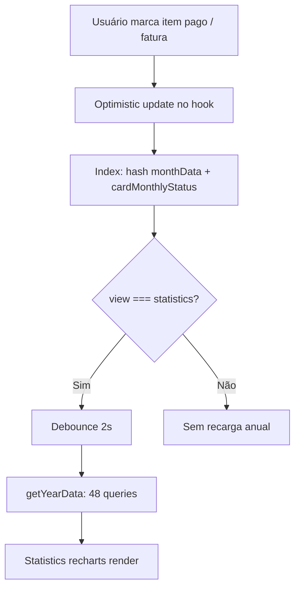

# Relatório de Performance — Frontend Supabase

| Campo | Valor |
|-------|-------|
| **Data** | 2026-06-17 |
| **Agente** | Performance & Scalability Engineer (`docs/PERFORMANCE/performance-specialist.mdc`) |
| **Escopo** | `frontend/src` — pós-correções QA/Dev |
| **Referências** | [Relatório Dev](../DEV/relatorio-correcoes-qa.md), [Validação](../VALIDATION/relatorio-validacao-correcoes-qa.md) |
| **Build** | `npm run build` — bundle JS **1.277 MB** (gzip **359 KB**) |

---

## Resumo executivo

O frontend está **adequado para beta fechado com poucos usuários e volume moderado de lançamentos por mês**. As correções recentes melhoraram consistência e UX, mas introduziram ou mantiveram padrões com custo mensurável em rede e renderização.

| Severidade | Achados | Ação dev |
|------------|---------|----------|
| Alto | 3 | Ajustar |
| Médio | 5 | Ajustar quando possível |
| Baixo | 4 | Backlog / avaliar custo-benefício |
| Sem ação | 6 | Manter como está |

**Veredito:** existem gargalos reais que o dev deve endereçar — principalmente a carga da visão anual (`getYearData`) e o bundle monolítico com Recharts. Não há indícios de problema crítico de disponibilidade hoje, mas o impacto cresce com uso intenso da visão anual e volume de transações.

---

## O que está bem (não otimizar agora)

| Área | Evidência | Motivo para manter |
|------|-----------|-------------------|
| Índices no banco | `setup-completo.sql` — `(user_id, year_month)` em incomes/expenses/investments; índice em `payment_method` | Queries mensais filtradas corretamente |
| Status de cartões por mês | `getAllCardMonthlyStatuses` — **1 query** por mês, não N queries por cartão | Padrão eficiente |
| `canDeleteCreditCard` | `select('*', { count: 'exact', head: true })` | Evita transferir linhas |
| Debounce 2s em `yearData` | `Index.tsx` L166-177 | Reduz rajadas ao marcar vários itens |
| Cálculos financeiros | `monthTotals.ts`, `financialRuleCalculations.ts` — O(n) sobre listas do mês | Custo desprezível vs rede |
| Optimistic updates | `useSupabaseFinance` — toggle paid/received sem refetch | Boa latência percebida |
| Sequenciamento cartões → status | Load inicial aguarda `fetchCreditCards` antes de status | Correto; custo +1 round-trip aceitável |

---

## Achados — ajustes recomendados para o Dev

---

### 1. Visão anual dispara ~48 requests Supabase por recarga

**Severidade:** Alto

**Localização:**
- `frontend/src/hooks/useSupabaseFinance.ts` L737-773 (`getYearData`)
- `frontend/src/pages/Index.tsx` L133-180, L182-193 (`handleViewChange`)

**Evidência:**

`getYearData` cria 12 promises em paralelo; cada uma executa 4 queries:

```typescript
// Por mês: incomes + expenses + investments + cardMonthlyStatuses
const [incomesData, expensesData, investmentsData, cardStatuses] = await Promise.all([...]);
```

**Total por invocação:** 12 × 4 = **48 requests HTTP** ao Supabase.

Gatilhos atuais:
1. Entrar na visão anual (`handleViewChange`) — imediato
2. Debounce de 2s após mudança em flags `received`/`paid`/`invested` ou `cardMonthlyStatus`
3. Reset de ano + recarga quando `yearData.length === 0`

**Impacto atual:**
- Usuário percebe delay de 1–3s+ na visão anual (rede + parsing), especialmente em 3G/4G
- Spinner/overlay frequente ao marcar faturas ou toggles com visão anual aberta
- 48 queries por usuário por recarga — pressão desnecessária no PostgREST

**Impacto futuro:**
- 100 usuários alternando visão anual: ~4.800 queries/min em pico
- Usuário com histórico denso: payloads maiores por query, tempo linear ao crescer registros/mês

**Recomendação (prioridade 1):**

1. **Atualização incremental:** ao mudar apenas o mês corrente, fazer merge em `yearData[monthIndex]` em vez de recarregar 12 meses.
2. **Alternativa de médio prazo:** RPC Postgres `get_year_summary(user_id, year)` retornando totais efetivados agregados (12 linhas), sem trazer todas as transações.
3. **Cache em memória:** manter `yearData` válido por `currentYear` e invalidar só o mês alterado.

**Ganho esperado:** Alto

**Complexidade:** Média (incremental) / Alta (RPC)

---

### 2. Recharts no bundle principal — ~1,28 MB JS sem code splitting

**Severidade:** Alto

**Localização:**
- `frontend/src/pages/Index.tsx` L14 — `import { Statistics } from '@/components/Statistics'`
- `frontend/src/components/Statistics.tsx` — importa `recharts`
- `frontend/vite.config.ts` — sem `manualChunks` nem lazy routes

**Evidência:**

Build de produção:

```
dist/assets/index-*.js   1.277.60 kB │ gzip: 358.83 kB
```

`Statistics` (e Recharts) é carregado mesmo quando o usuário permanece só na visão mensal — cenário mais comum.

**Impacto atual:**
- First Contentful Paint / Time to Interactive maiores em mobile
- Mais dados na rede no primeiro acesso (~360 KB gzip)

**Impacto futuro:**
- Cada novo usuário paga o custo total do gráfico sem usá-lo
- Dificulta meta de PWA / conexões lentas

**Recomendação (prioridade 2):**

```typescript
// Index.tsx
const Statistics = lazy(() => import('@/components/Statistics').then(m => ({ default: m.Statistics })));
```

Envolver com `<Suspense>` na branch `view === 'statistics'`.

Opcional: `build.rollupOptions.output.manualChunks` para separar `recharts`.

**Ganho esperado:** Alto (first load)

**Complexidade:** Baixa

---

### 3. Recarga completa do ano ao navegar meses na visão anual

**Severidade:** Alto

**Localização:** `frontend/src/pages/Index.tsx` L148-180

**Evidência:**

O efeito de debounce depende de `monthData` inteiro. Ao trocar `currentMonth` no `MonthNavigator` (mesmo na visão anual), `fetchMonthData` carrega só o mês novo (3 queries), mas o hash muda e, após debounce, **`getYearData` recarrega os 12 meses** (48 queries) — embora 11 meses já estivessem em `yearData`.

**Impacto atual:**
- Navegar jan → fev → mar na visão anual = múltiplas rajadas de 48 queries
- Experiência lenta e custosa sem benefício proporcional

**Recomendação:**

- Separar gatilhos: mudança de `currentMonth` → atualizar só `yearData[monthIndex]` (reutilizar `monthData` + `cardMonthlyStatus` já carregados).
- Reservar `getYearData` completo para: primeira entrada na visão anual, mudança de `currentYear`, ou invalidação explícita.

**Ganho esperado:** Alto

**Complexidade:** Média

---

### 4. Refetch completo do mês após cada criação (redundante com optimistic update)

**Severidade:** Médio

**Localização:** `frontend/src/hooks/useSupabaseFinance.ts` — `addIncome` L176, `addExpense` L270, `addInvestment` L511

**Evidência:**

Fluxo atual:
1. Optimistic update adiciona item com `tempId`
2. `create*` no serviço
3. `await fetchMonthData(currentMonth, false)` — **3 queries** (incomes, expenses, investments)

O serviço já retorna o registro criado (`createIncome` → `Income`, etc.), mas o hook descarta o retorno e refaz fetch completo.

**Impacto atual:**
- Cada criação = 1 write + 3 reads extras
- Cadastro rápido de 5 itens = 15 queries de leitura desnecessárias

**Recomendação:**

Substituir refetch por merge do retorno do serviço:

```typescript
const created = await incomesService.createIncome(...);
setIncomes(prev => prev.filter(i => i.id !== tempId).concat(created));
```

Manter `fetchMonthData` apenas quando a operação afeta outros meses (`applyToAllMonths`, parcelas, repetição).

**Ganho esperado:** Médio

**Complexidade:** Baixa

---

### 5. Hook monolítico causa re-render em cascata de toda a árvore

**Severidade:** Médio

**Localização:**
- `frontend/src/hooks/useSupabaseFinance.ts` — estado único + objeto `monthData` recriado L775-779
- `frontend/src/pages/Index.tsx` — 40+ props para `MonthRecordsSection`
- `frontend/src/components/ExpenseSection.tsx` — ~1.537 linhas, sem `React.memo`

**Evidência:**

Qualquer `setIncomes`, `setExpenses`, `setCardMonthlyStatus`, etc. re-renderiza:
- `Index` inteiro
- `MonthSummarySection`, `MonthRecordsSection`
- `IncomeSection`, `ExpenseSection`, `InvestmentSection`, `CreditCardStrip` — mesmo com abas inativas montadas

Não há `React.memo`, `lazy`, nem divisão de contexto no projeto (`grep` sem resultados).

**Impacto atual:**
- Toggle de "pago" em 1 gasto re-renderiza `ExpenseSection` completo
- Listas longas (50+ itens) podem causar jank perceptível em dispositivos modestos

**Impacto futuro:**
- Piora linearmente com tamanho das listas e quantidade de cartões/categorias

**Recomendação (incremental, sem big bang):**

1. `React.memo` em `IncomeSection`, `ExpenseSection`, `InvestmentSection`, `CreditCardStrip` com comparadores nos arrays de dados.
2. Renderizar só a aba ativa em `MonthRecordsSection` (unmount das inativas) — hoje `TabsContent` pode manter filhos montados.
3. Médio prazo: extrair estado de seleção ou de seção ativa para reduzir prop drilling.

**Ganho esperado:** Médio (percepção em listas grandes)

**Complexidade:** Média

---

### 6. Criação de parcelas/repetições — N round-trips sequenciais

**Severidade:** Médio

**Localização:** `frontend/src/services/adapters/supabase/expenses.ts` L127-178 (e espelhos em `incomes.ts`, `investments.ts`)

**Evidência:**

Parcela 12x = 1 INSERT inicial + até 11 INSERTs em loop `await` sequencial. Rollback compensatório melhora integridade, mas não reduz latência.

**Impacto atual:**
- Criar despesa 12x pode levar vários segundos
- UI bloqueada em `isSubmitting` até concluir

**Recomendação:**

- RPC Postgres com `INSERT ... SELECT` em lote, ou
- `supabase.from('expenses').insert([...])` com array único quando possível

**Ganho esperado:** Médio (operações de escrita compostas)

**Complexidade:** Média/Alta

---

### 7. `@tanstack/react-query` no bundle sem uso de cache

**Severidade:** Baixo

**Localização:** `frontend/src/App.tsx` L4, L16 — `QueryClientProvider` sem `useQuery`/`useMutation` no código

**Evidência:**

Provider instanciado; nenhum consumo de React Query nos hooks — todo cache manual em `useState`.

**Impacto atual:**
- Peso adicional no bundle (~dezenas de KB gzip)
- Complexidade arquitetural sem benefício

**Recomendação:**

- **Opção A (simples):** remover `QueryClientProvider` e dependência se não houver plano imediato de adoção.
- **Opção B (estratégica):** migrar `getYearData` e `fetchMonthData` para React Query com `staleTime` — resolveria achados #1 e #4 com cache nativo.

**Ganho esperado:** Baixo (bundle) / Alto (se migrar queries)

**Complexidade:** Baixa (remover) / Alta (migrar)

---

### 8. `AuthContext` recria value e funções a cada render

**Severidade:** Baixo

**Localização:** `frontend/src/contexts/AuthContext.tsx` L119-121

**Evidência:**

`signUp`, `signIn`, `signOut`, `resetPassword` não estão em `useCallback`. O objeto do Provider é novo a cada render.

**Impacto atual:**
- Baixo — `AuthContext` muda raramente após login
- Já há otimização de `sessionRef` para evitar re-renders em `TOKEN_REFRESHED`

**Recomendação:**

`useMemo` no value + `useCallback` nas funções — quick win se for mexer no arquivo.

**Ganho esperado:** Baixo

**Complexidade:** Baixa

---

### 9. Hash de mudança com `JSON.stringify` em arrays filtrados

**Severidade:** Baixo

**Localização:** `frontend/src/pages/Index.tsx` L152-157

**Evidência:**

A cada mudança em `monthData` ou `cardMonthlyStatus` (visão anual), o efeito:
- Filtra 3 arrays
- Ordena IDs
- Serializa JSON

Com listas pequenas é irrelevante; com centenas de itens marcados, executa a cada toggle.

**Recomendação:**

Substituir por contador/versionamento explícito no hook ao mutar flags, ou hash numérico incremental.

**Ganho esperado:** Baixo

**Complexidade:** Baixa

---

### 10. `useFinancialRule` carregado em `MonthSummarySection` independentemente

**Severidade:** Baixo

**Localização:** `frontend/src/components/MonthSummarySection.tsx` + `frontend/src/hooks/useFinancialRule.ts`

**Evidência:**

Query `getFinancialRule()` no mount da seção de resumo — 1 request adicional no load do dashboard (aceitável, mas duplicaria se outro componente também chamasse o hook).

**Recomendação:**

Manter por ora. Se surgir segundo consumidor, elevar regra para contexto ou React Query compartilhado.

**Ganho esperado:** Baixo

**Complexidade:** Média

---

## Mapa da cadeia financeira (visão anual)



**Ponto de alavancagem:** entre C e F — evitar recarga total.

---

## Projeção de escala

| Cenário | Risco principal | Observação |
|---------|-----------------|------------|
| 100 usuários ativos | Baixo | Padrão atual suporta |
| 1.000 usuários, uso mensal dominante | Baixo | 3 queries/mês navegado |
| 1.000 usuários, visão anual frequente | **Médio** | 48 queries × acessos |
| 10.000 usuários | **Alto** sem RPC/cache | PostgREST vira gargalo |
| Usuário com 500+ lançamentos/mês | **Médio** | Payload + re-render (#5) |

---

## Backlog priorizado para o Dev

| Prioridade | Item | Esforço | Ganho |
|------------|------|---------|-------|
| **P1** | Atualização incremental de `yearData` (não recarregar 12 meses) | Médio | Alto |
| **P1** | Lazy load de `Statistics` + Recharts | Baixo | Alto |
| **P2** | Eliminar refetch pós-create quando serviço retorna entidade | Baixo | Médio |
| **P2** | `React.memo` + renderizar só aba ativa em `MonthRecordsSection` | Médio | Médio |
| **P3** | Batch insert / RPC para parcelas | Médio/Alto | Médio |
| **P3** | Adotar React Query **ou** remover provider morto | Variável | Médio/Alto |
| **P4** | Memoizar `AuthContext` | Baixo | Baixo |

---

## O que NÃO fazer (evitar otimização prematura)

| Sugestão descartada | Motivo |
|---------------------|--------|
| Memoizar todos os componentes | Sem profiling, custo de manutenção > ganho |
| Virtualizar listas agora | Sem evidência de listas com centenas de itens em produção |
| Migrar para Web Workers nos cálculos | `monthTotals` é O(n) barato |
| Reduzir debounce abaixo de 2s | Aumentaria queries na visão anual |
| Cache agressivo sem invalidação | Risco de inconsistência financeira |

---

## Métricas sugeridas (antes de implementar)

Para validar ganhos após ajustes P1/P2:

| Métrica | Como medir | Meta sugerida |
|---------|------------|---------------|
| Requests ao abrir visão anual | Network tab — contagem Supabase | ≤ 12 (ideal: 1 RPC) |
| Bundle inicial (gzip) | `npm run build` | Redução ≥ 80 KB |
| Tempo até gráfico interativo | Lighthouse / Performance | < 3s em 4G |
| Re-renders ao toggle paid | React DevTools Profiler | < 3 componentes críticos |

---

## Resultado final

| Veredito | Detalhe |
|----------|---------|
| **Ajustes necessários** | Sim — 3 itens Alto, 5 Médio |
| **Bloqueante para release beta** | Não, com ressalvas de UX na visão anual |
| **Bloqueante para escala** | Sim, sem otimizar `getYearData` |

O dev deve focar primeiro em **reduzir as 48 queries da visão anual** e **lazy load do Recharts** — maior retorno com complexidade controlada.

---

## Referências

- [Performance Specialist](./performance-specialist.mdc)
- [Relatório Dev](../DEV/relatorio-correcoes-qa.md)
- [Validação QA](../VALIDATION/relatorio-validacao-correcoes-qa.md)
- [QA Transversal — performance getYearData](../QA/relatorios/99-transversal.md)
