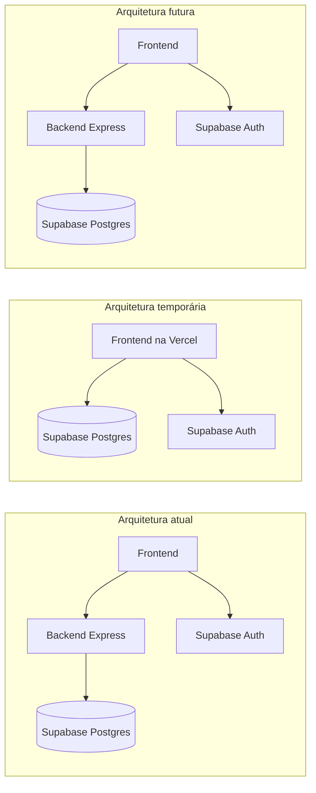

# Plano de Ação — Frontend Direto ao Supabase (Fase Temporária)

Documento de referência para a fase de testes do Tidy Month Tracker com **1 a 3 usuários**, utilizando apenas o **frontend** em produção (Vercel), com acesso direto ao banco via **Supabase**, dispensando temporariamente o backend Express.

O backend **permanece no repositório** como implementação de referência e será reativado no futuro.

---

## Contexto

| Item | Situação atual |
|------|----------------|
| Frontend | React + Vite, hospedagem planejada na **Vercel** |
| Backend | Express + TypeScript, não adequado ao modelo serverless da Vercel sem refatoração |
| Banco + Auth | Supabase (projeto **tidy-tracker**, ID `yoinjsmlntehikilqoxx`) |
| Usuários na fase | 1 a 3 (beta fechado) |

### Objetivo da fase temporária

- Publicar o app **gratuitamente** na Vercel (apenas build estático)
- Eliminar a necessidade de hospedar o backend nesta fase
- Manter o backend intacto para reativação futura

### Arquitetura



---

## Por que essa abordagem faz sentido

1. **Auth já é direta** — `AuthContext` usa `supabase-js`; login não depende do backend.
2. **RLS já configurado** — todas as tabelas têm políticas `auth.uid() = user_id`.
3. **Schema pronto** — auditoria via MCP confirmou que o banco remoto está alinhado com o código (ver seção abaixo).
4. **Utils de negócio no frontend** — `repeatMonths` e `installments` já existem em `frontend/src/utils/business/` com testes.
5. **Backend preservado** — troca de provedor de dados via variável de ambiente, sem remover código.

---

## Estado do banco de dados (auditoria)

**Conclusão: não são necessárias alterações de schema** para esta fase.

### Projeto Supabase

| Campo | Valor |
|-------|-------|
| Nome | `tidy-tracker` |
| Project ID | `yoinjsmlntehikilqoxx` |
| Região | `us-east-2` |

> **Nota:** o arquivo `supabase/config.toml` local pode apontar para outro ID. O projeto em uso é `yoinjsmlntehikilqoxx`. Alinhar o config local quando conveniente.

### Tabelas confirmadas (RLS habilitado)

| Tabela | Políticas RLS |
|--------|---------------|
| `profiles` | SELECT, INSERT, UPDATE |
| `credit_cards` | SELECT, INSERT, UPDATE, DELETE |
| `incomes` | SELECT, INSERT, UPDATE, DELETE |
| `expenses` | SELECT, INSERT, UPDATE, DELETE |
| `investments` | SELECT, INSERT, UPDATE, DELETE |
| `finance_settings` | SELECT, INSERT, UPDATE |
| `credit_card_monthly_status` | SELECT, INSERT, UPDATE, DELETE |
| `financial_rule` | SELECT, INSERT, UPDATE, DELETE |

### Migrations do repositório — já aplicadas no remoto

- `add_item_date_and_created_at.sql` — coluna `date` em `expenses`; `date` nullable em `incomes` e `investments`
- `add_received_invested_fields.sql` — `received` e `invested`
- `create_financial_rule.sql` — tabela `financial_rule`
- `add_expenses_payment_method_index.sql` — índice em `payment_method`

### Triggers confirmados

- `on_auth_user_created` → cria `profiles` e `finance_settings` no signup
- `update_*_updated_at` em todas as tabelas

### Ao voltar ao backend

**Não é necessário reverter o banco.** Frontend e backend leem e gravam nas mesmas tabelas. Dados criados na fase temporária permanecem compatíveis.

---

## Estratégia de implementação

### Padrão adaptador (recomendado)

Manter a interface pública dos serviços e alternar a implementação via variável de ambiente:

```
frontend/src/services/
├── expenses.ts          # interface pública (não muda para os componentes)
├── incomes.ts
├── investments.ts
├── creditCards.ts
├── settings.ts
├── financialRule.ts
└── adapters/
    ├── api.ts           # implementação atual (apiClient → backend)
    └── supabase.ts      # implementação temporária (supabase.from)
```

Variável de ambiente sugerida:

```env
VITE_DATA_PROVIDER=supabase   # fase temporária
# VITE_DATA_PROVIDER=api        # quando o backend voltar
```

Os componentes e hooks **não devem importar** `apiClient` ou `supabase` diretamente — apenas os módulos em `services/`.

### Mapeamento de colunas

O banco usa `snake_case`; o domínio do frontend usa `camelCase`. Os adaptadores Supabase devem fazer a conversão na fronteira (ex.: `payment_method` ↔ `paymentMethod`, `year_month` ↔ `yearMonth`).

### Ordem de migração dos serviços

| Prioridade | Serviço | Complexidade | Motivo |
|------------|---------|--------------|--------|
| 1 | `creditCards.ts` | Baixa | CRUD direto |
| 2 | `settings.ts` | Baixa | CRUD + defaults |
| 3 | `financialRule.ts` | Baixa | CRUD + validação no cliente |
| 4 | `incomes.ts` | Média | Repetição mensal |
| 5 | `investments.ts` | Média | Repetição mensal |
| 6 | `expenses.ts` | Alta | Parcelas, `applyToAllMonths`, `ensureRemainingInstallmentsExist` |

Reutilizar `frontend/src/utils/business/repeatMonths.ts` e `installments.ts` — mesma lógica do backend.

---

## Variáveis de ambiente

### Desenvolvimento e produção (fase temporária)

```env
# frontend/.env
VITE_SUPABASE_URL=https://yoinjsmlntehikilqoxx.supabase.co
VITE_SUPABASE_PUBLISHABLE_KEY=<anon public key>
VITE_DATA_PROVIDER=supabase
```

`VITE_API_URL` **não é necessária** nesta fase.

### Quando o backend voltar

```env
VITE_DATA_PROVIDER=api
VITE_API_URL=https://<url-do-backend>
```

---

## Deploy na Vercel

### Configuração do projeto

| Campo | Valor |
|-------|-------|
| Root Directory | `frontend` |
| Framework Preset | Vite |
| Build Command | `npm run build` |
| Output Directory | `dist` |
| Install Command | `npm install` (na raiz do monorepo, por causa dos workspaces) |

### SPA — React Router

Criar `frontend/vercel.json` com rewrite para `index.html`:

```json
{
  "rewrites": [
    { "source": "/(.*)", "destination": "/index.html" }
  ]
}
```

Sem isso, rotas como `/auth` retornam 404 ao recarregar a página.

### Supabase Auth — URLs de produção

No dashboard do Supabase → **Authentication → URL Configuration**:

- **Site URL:** `https://<seu-app>.vercel.app`
- **Redirect URLs:** `https://<seu-app>.vercel.app/**`

---

## Segurança

### O que protege os dados

- **RLS** em todas as tabelas (`auth.uid() = user_id`)
- Chave **anon** no frontend (nunca expor `service_role`)
- JWT do usuário em cada requisição via `supabase-js`

### Limitações aceitáveis para 1–3 testers

| Aspecto | Com backend | Frontend direto |
|---------|-------------|-----------------|
| Isolamento por usuário | RLS + filtro no servidor | RLS |
| Validação de negócio | Servidor (confiável) | Cliente (bypassável) |
| Transações multi-insert | Atômicas na conexão | Várias chamadas HTTP |

### Risco principal: operações não atômicas

Criar despesa parcelada envolve vários `INSERT`. Se uma falhar no meio, pode haver inconsistência.

**Mitigações:**

- **Curto prazo:** tratamento de erro no cliente; aceitável para beta fechado
- **Médio prazo (opcional):** funções RPC no Postgres para operações compostas — compatíveis com o backend futuro, sem necessidade de reverter

### Alertas do advisor Supabase (não bloqueantes)

- `handle_new_user` exposta via RPC — considerar revogar `EXECUTE` de `anon`/`authenticated` (o trigger de auth continua funcionando)
- Proteção de senha vazada desabilitada — habilitar no Auth quando conveniente

---

## Regenerar tipos TypeScript

O arquivo `frontend/src/integrations/supabase/types.ts` pode estar desatualizado (ex.: coluna `expenses.date`). Após estabilizar o schema, regenerar:

```bash
# Via Supabase CLI (com projeto linkado)
supabase gen types typescript --project-id yoinjsmlntehikilqoxx > frontend/src/integrations/supabase/types.ts
```

Ou via MCP / dashboard do Supabase.

---

## Checklist de implementação

### Código

- [ ] Criar estrutura `services/adapters/` (`api.ts` e `supabase.ts`)
- [ ] Adicionar `VITE_DATA_PROVIDER` e lógica de seleção do adaptador
- [ ] Migrar `creditCards.ts`
- [ ] Migrar `settings.ts`
- [ ] Migrar `financialRule.ts`
- [ ] Migrar `incomes.ts`
- [ ] Migrar `investments.ts`
- [ ] Migrar `expenses.ts`
- [ ] Regenerar `types.ts` do Supabase
- [ ] Testar fluxos críticos localmente com `VITE_DATA_PROVIDER=supabase`

### Infraestrutura

- [ ] Alinhar `supabase/config.toml` com project ID `yoinjsmlntehikilqoxx`
- [ ] Configurar env vars na Vercel
- [ ] Criar `frontend/vercel.json` (rewrite SPA)
- [ ] Atualizar Site URL e Redirect URLs no Supabase Auth
- [ ] Deploy na Vercel e smoke test com usuário real

### Validação

- [ ] Login / logout / sessão persistente
- [ ] CRUD de receitas, despesas, investimentos
- [ ] Despesa fixa com repetição mensal
- [ ] Despesa parcelada (criar, editar, deletar parcelas)
- [ ] Cartões de crédito e status mensal
- [ ] Configurações (tags, categorias, métodos)
- [ ] Regra financeira
- [ ] Recarregar página em `/` e `/auth` (roteamento SPA)

---

## Plano de retorno ao backend

1. Hospedar o backend (Render, Fly.io, Railway, etc.)
2. Configurar `VITE_DATA_PROVIDER=api` e `VITE_API_URL`
3. Atualizar `CORS_ORIGIN` no backend para a URL da Vercel
4. **Nenhuma alteração no banco é necessária**
5. O código do adaptador `api.ts` já existente volta a ser o default

O adaptador Supabase pode permanecer no repositório para desenvolvimento local sem backend, se desejado.

---

## Referências no repositório

| Arquivo | Descrição |
|---------|-----------|
| `supabase/setup-completo.sql` | Schema base + RLS + triggers |
| `supabase/migrations/` | Migrations incrementais |
| `frontend/src/integrations/supabase/client.ts` | Cliente Supabase |
| `frontend/src/services/` | Camada de dados consumida pelos componentes |
| `frontend/src/utils/business/` | Lógica de repetição e parcelas |
| `backend/src/services/` | Referência da lógica de negócio a espelhar |

---

## Histórico

| Data | Descrição |
|------|-----------|
| 2026-06-12 | Criação do plano após discussão de arquitetura e auditoria do banco via MCP |
