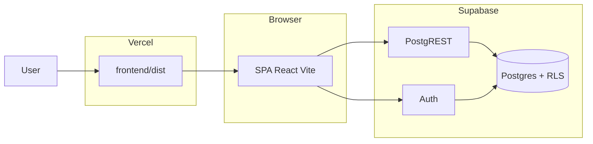
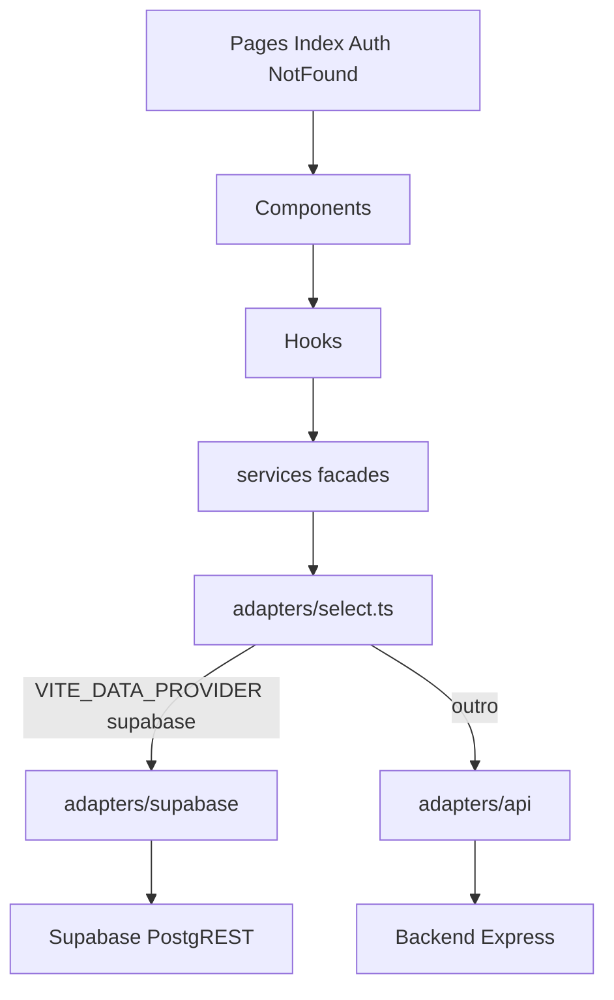

# Diagrama de sistema

Produção (caminho real):

Camadas internas do frontend:

Modo `api` (local / futuro): o SPA continua autenticando no Supabase; o CRUD iria ao Express com `Authorization: Bearer <jwt>`. O Express de hoje **não** implementa o domínio completo — ver [`api-design.md`](./api-design.md).
